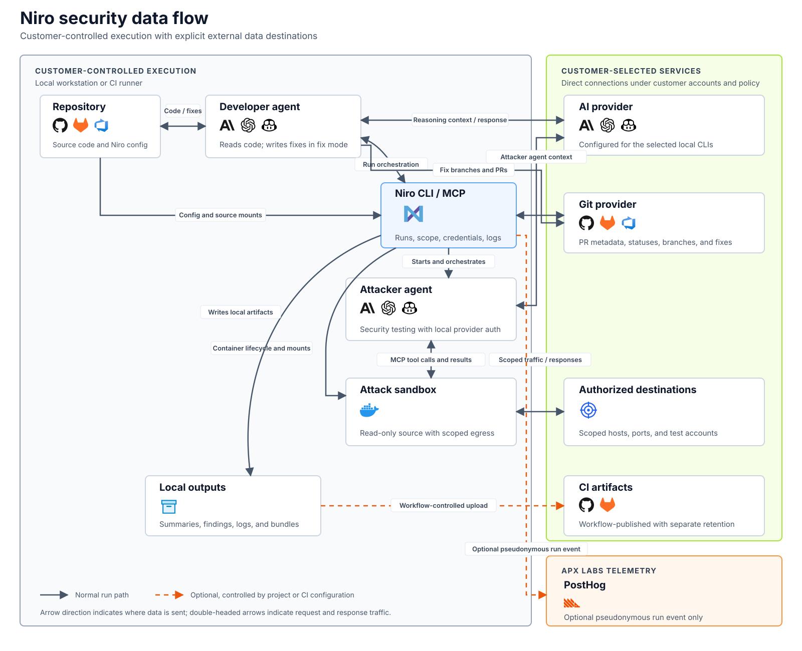

# Security and data

Niro runs in your local or CI environment. It does not require an APX
Labs-hosted execution service and does not proxy model requests. This page shows
where Niro runs, where data can go, and the controls available to you.

## Data flow



Solid arrows are normal run paths. Dashed arrows are optional and depend on
your project or CI configuration.

- **Customer-controlled execution:** The Niro CLI, developer agent, and attacker
  agent run on your workstation or CI runner. Attack tools run in a Docker or
  Podman sandbox. Niro writes local artifacts to your filesystem.
- **AI providers:** The developer agent and the attacker agent connect directly
  to the provider configured for Claude Code, Codex, or Copilot CLI. Niro does
  not operate a model proxy, and the attack sandbox does not hold provider
  credentials or make model requests.
- **Authorized destinations:** The attack sandbox sends test traffic only to
  the hosts, CIDRs, and ports authorized in `scope.yaml` during a normal run.
- **Git and CI:** `fix` can create branches and pull requests in your Git
  provider. Niro creates artifact files in your workspace; your CI workflow
  decides whether to publish them and how long to retain them.
- **APX Labs:** APX Labs does not need access to your repository, credentials,
  findings, or logs. When telemetry is enabled, Niro sends repository-usage and
  terminal run events to APX Labs' PostHog project.

## Security FAQ

### Where does Niro run?

The Niro CLI, developer agent, and attacker agent run on your workstation or CI
runner. The attacker agent executes command-line and browser interactions
through a Docker or Podman sandbox running in your environment.

### How are agent CLI actions approved?

Local `niro find` and `niro fix` commands launch the selected agent CLI
interactively by default. Niro submits the initial message, and the agent CLI
shows its native permission requests in the same terminal.

`--autonomous` explicitly selects unattended execution without those approval
prompts. In that mode, commands inherit the permissions of the OS user running
Niro, including that user's accessible files, processes, credentials, and
network. CI and other non-interactive environments must pass the flag; Niro
does not turn it on automatically. [Agent CLI privileges and threat
model](agent-cli-security.md) documents the exact provider invocations,
environment inheritance, host egress, repository prompt-injection boundary,
and the difference between `find` and `fix`.

### Where can my code and data go?

Depending on the command and your configuration, data can go directly to:

- your selected AI provider for reasoning by the developer agent and attacker
  agent;
- destinations authorized in `scope.yaml` for security-test traffic;
- your Git provider for repository, branch, pull-request, comment, and status
  operations;
- your CI platform when your workflow publishes Niro artifacts; and
- APX Labs' PostHog project when telemetry is enabled.

These connections are not routed through an APX Labs execution service.

### What reaches the AI provider?

The selected provider can receive context needed for the run, including
relevant source, prompts, diffs, command output, errors, HTTP observations, test
results, and remediation context. Requests use the selected CLI's existing
provider authentication and go directly to that provider. The provider's data
use, retention, residency, and access settings apply.

### How is testing restricted to authorized targets?

For normal attack execution, the sandbox uses default-deny outbound networking.
It can resolve and connect only to the hosts or CIDRs and ports allowed in
`niro/scope.yaml`; explicit exclusions take precedence.

This restriction applies to target-facing tools in the attack-tool sandbox,
not to the host-side agent CLI or its subprocesses. Niro does not filter their
host network egress.

Scope controls network destinations, not HTTP paths, methods, tenants, or
actions within an authorized host and port. Use dedicated test environments and
least-privilege test accounts where possible.

### What happens during scope discovery?

`niro draft scope` is a separate, explicit discovery operation. It uses broader
outbound access because an allowlist does not exist yet, while still blocking
cloud and link-local metadata ranges. It writes `scope.draft.yaml`, never
`scope.yaml`, so a person must review and approve the result before a normal
run.

### Does my AI provider receive target credentials?

Niro does not serialize raw target credential values into prompts or normal
credential-list responses sent to the AI provider. The provider receives
credential metadata and environment-variable names. Raw values are injected
into the environment of sandboxed commands, so the attacker agent can use
credentials without placing them directly in model context.

Command output and target responses do return to the AI provider. If a command
prints a credential, or an application response reflects it, that value can
enter model context. Use dedicated, short-lived, least-privilege test
credentials and apply your AI provider's retention controls.

### What can APX Labs access?

APX Labs does not need access to your repository, source code, target
credentials, findings, exploit proofs, traffic, or logs for a run to complete.
Those remain in your environment and the providers you configure.

When telemetry is enabled, APX Labs receives the repository-usage and aggregate
security-value events described below. Niro does not send run content to an
APX Labs-hosted model or execution service.

### What telemetry does Niro collect?

Telemetry is enabled by default. For a repository-backed run, Niro sends the
repository's provider-native ID, provider scope, readable name, installation
ID, and acceptance time after preflight succeeds. Niro also sends an
event when an accepted pentest completes or fails. It contains installation,
repository, and run IDs; completion time and outcome; and aggregate counts of
unique, evidence-backed vulnerabilities by severity. Counts include final
failed findings and previously failed findings that no longer reproduce;
blocked findings do not count.

Telemetry does not show whether Niro created a fix or pull request, whether a
pull request was merged, or whether a change was deployed.

It does not contain source code, prompts, credentials, target URLs, raw HTTP
traffic, finding text, exploit payloads, or logs. Disable it per project:

```yaml
telemetry: false
```

See [Telemetry](telemetry.md) for the complete event schema and endpoint.

### Where are findings and artifacts stored?

- Temporary captures and exploit work stay in the sandbox workspace and are
  removed with the container.
- Credentials, fixtures, finding proofs, run state, and terminal artifacts stay
  in local `niro/` paths that are added to `.gitignore`.
- CLI, attack-tool, and security logs are written to Niro's operating-system
  cache directory on your host.
- Terminal summaries, reports, and bundles are colocated under
  `<config-dir>/artifacts/`; its `manifest.json` records only files produced by
  the latest run. Current workflow examples also retain workspace compatibility
  copies for upload.
- Branches, pull requests, comments, and statuses are stored by your Git
  provider when those features are used.
- CI artifacts are uploaded only when your workflow is configured to publish
  them.

Your filesystem, Git provider, and CI retention policies control how long these
outputs remain available.

### Can Niro change or merge my code?

`niro find` does not create branches, commits, or pull requests. `niro fix`
allows the developer agent to prepare fixes, validation evidence, commits, and
pull requests for confirmed findings. Niro never merges generated changes; you
review every diff and decide what to merge.

### How is data protected in transit and at rest?

Niro does not provide a separate hosted data store or network tunnel. Transport
encryption depends on the AI, Git, CI, telemetry, and target endpoints you
configure. An HTTP target authorized in `scope.yaml` remains HTTP.

Local configuration, logs, summaries, and bundles use your host filesystem.
At-rest protection depends on your host disk encryption and the controls of the
Git, CI, and AI providers you select.

### How do I delete Niro data?

Remove the sandbox container and delete the local `niro/` state, Niro cache
logs, summaries, and tar bundles you no longer need. Delete branches, pull
requests, comments, and CI artifacts through the relevant provider. Data sent
to an AI provider or PostHog is subject to that provider's retention controls.

## Contact

Have a security or due-diligence question not answered here? Contact
[security@apxlabs.ai](mailto:security@apxlabs.ai).
